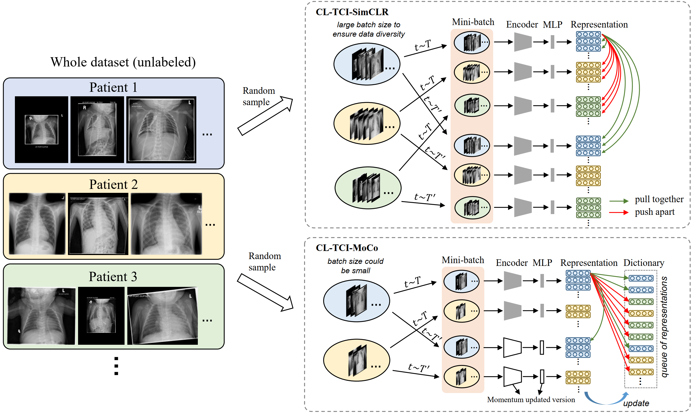
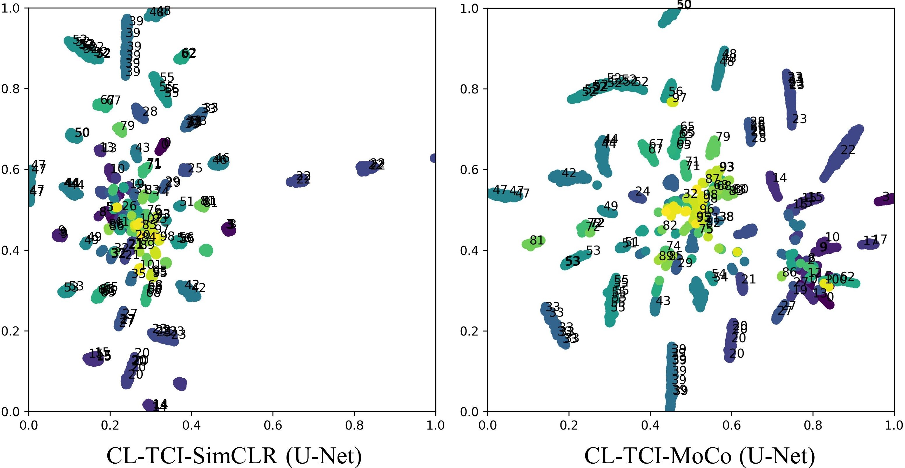

## Contrastive learning with temporal correlated medical image

Implementation of paper "Contrastive Learning with Temporal Correlated Medical Images: A Case Study using Lung Segmentation in Chest X-Rays"

<p align="center">
  
</p>

### Dataset
 - BCH-CXR: from Boston Children's Hospital (not public available because of privacy issue)
 - JSRT: [http://db.jsrt.or.jp/eng.php](http://db.jsrt.or.jp/eng.php)
 - Montgomery: [https://lhncbc.nlm.nih.gov/LHC-publications/pubs/TuberculosisChestXrayImageDataSets.html](https://lhncbc.nlm.nih.gov/LHC-publications/pubs/TuberculosisChestXrayImageDataSets.html)

### Preprocessing

Use python file in the `dataset` folder to preprocess the dataset, convert the original format to jpg or png and rename the files for cross validation training.
```
python generate_jsrt_dataset.py --data_dir=d:/data/JSRT/All247images/ \
--label_dir=d:/data/JSRT/scratch/ \
--result_dir=d:/data/JSRT/converted_JSRT/

python generate_montgomery_dataset.py --data_dir=d:/data/MontgomerySet/CXR_png  \
--label_dir=d:/data/MontgomerySet/ManualMask/  \
--result_dir=d:/data/MontgomerySet/converted_Montgomery/
```

### Running

(1) CL-TCI-SimCLR
```
python train_contrastive_simclr.py --batch_size 32 --device cuda:0 \ 
--classes 512 --initial_filter_size 32 --epochs 500 --temp 0.1 \ 
--dataset cxr --model_name unet --data_dir /bch_cxr_dataset/\
--lr 1e-1 --min_lr 1e-4 --patch_size 256 --experiment_name contrast_bch_unet_cltci_simclr_\
--do_contrast --contrastive_method cl_tci_simclr
```

(2) CL-TCI-MoCo
```
python train_contrastive_moco.py --batch_size 16 --device cuda:0 \ 
--classes 512 --initial_filter_size 32 --epochs 500 --temp 0.1 \ 
--dataset cxr --model_name unet --data_dir /bch_cxr_dataset/\
--lr 1e-1 --min_lr 1e-4 --patch_size 256 --experiment_name contrast_bch_unet_cltci_moco_\
--do_contrast
```

(3) finetuning on JSRT dataset using unet with 10 samples
```
python train_supervised_cv.py --device cuda:0 --batch_size 10 \
--epochs 200 --data_dir /jsrt_dataset/ \
--lr 1e-4 --min_lr 1e-6 --model_name unet --dataset jsrt \
--experiment_name supervised_jsrt_simclr_unet_s10_ \
--classes 3 --restart \
--pretrained_model_path /path/to/model.pth\
--enable_few_data --sampling_k 10
```

Other experimental running commands can be found in the `run_script.sh` file.

pretrained models can be found here: [google drive](https://drive.google.com/drive/folders/1a4OnH4bRnRZKZnOinKMvz8sx3VudYLJg?usp=sharing)

### T-SNE plots

<p align="center">
  
</p>

Each dot in the plot represents one CXR.
The number beside each dot is the unique patient id, CXRs of the same patient are marked with the same color.
From the plots, we can see that CXRs of the same patients are well clustered, which means the contrastive learning has helped the network learn features to distinguish CXRs from different patients.

